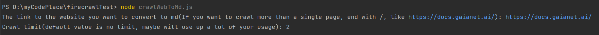
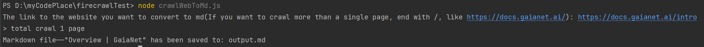
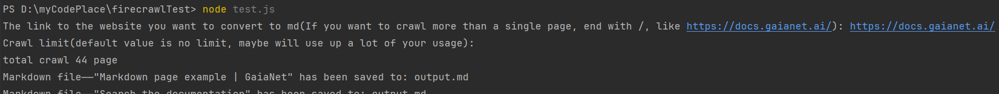

# How to run Firecrawl convert web to Markdown

## 1. Clone the project and install dependencies

```bash
git clone https://github.com/JYC0413/firecrawl-integration.git
cd firecrawl-integration
npm install
```

## 2. Modify environment variables to add your FireCrawl key
You can get this key from [FireCrawl API keys page](https://www.firecrawl.dev/app/api-keys).

If on MacOS/Linux
```bash
export FIRECRAWL_KEY="your_api_key_here"
```
### as a temporary environment variable

If on Windows, when using CMD
```bash
set FIRECRAWL_KEY=your_api_key_here
```
When using PowerShell
```bash
$env:FIRECRAWL_KEY="your_api_key_here"
```

### as a permanent environment variable
Use CMD in windows, enter the following command and open a new window to take effect
```bash
setx FIRECRAWL_KEY=your_api_key_here
```
Add .env file in the current directory
```dotenv
FIRECRAWL_KEY=your_api_key_here
```


## 3. Run crawlWebToMd.js

```bash
node crawlWebToMd.js
```

Follow the prompts to enter the URL you want to convert.


If you provide a URL that does not end with /, we will assume that you only want to convert this page to Markdown


_Note:_ `If you want to crawl the entire website, your usage may be consumed quickly or may not be sufficient.`

After that, you will get the result.